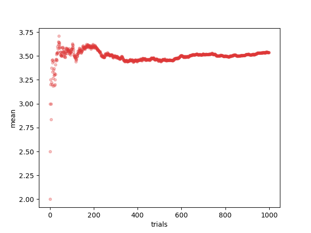
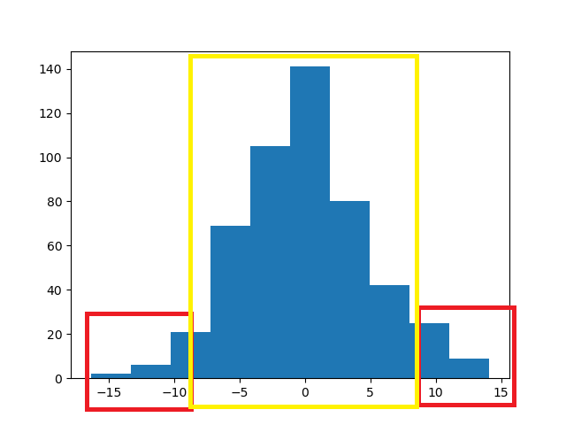
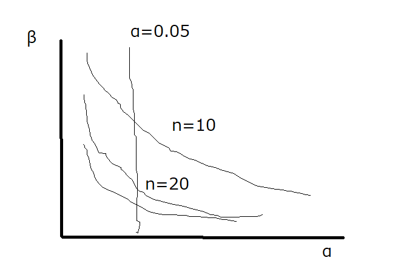

# データ分析

## 参考書籍

- 以下の書籍の自分なりのまとめ
  [データ分析に必須の知識・考え方 統計学入門(阿部 真人)](https://books.rakuten.co.jp/rb/16943959/)

## 1.1 データを分析する

### 〇データ分析の目的

データ分析の主な目的として、大きく以下の３つ 1. データを要約すること 1. 対象を説明すること 1. 新しく得られるデータを予測すること

#### 〇データを要約すること

生のデータをただ眺めてもなんもわからない。　 ⇒ 　データを要約して整理する手法が必要
例）平均値でデータの要約をする

#### 〇対象を説明すること

対象が持つ性質・関係性を明らかにし理解につなげること。人間だれしも自身の身の回りの事柄を観察し、関係性を見つけようとしている。
例）　赤いリンゴを食べたら甘く、青いリンゴを食べたらすっぱい　 ⇒ 　リンゴの色と味の間に関係性があるのでは？

ただし、ただただデータをとってグラフ化しただけでは、「たまたま得られた」可能性を排除できないし、傾向の強さの評価もできない。
**そこで、データ分析手法を用いることが必要になり、それによって初めて客観的な証拠（エビデンス）を手にしたことになる**

また説明（または理解）にはレベルが存在する。一般にデータ分析で登場する関係性には「因果関係」と「相関関係」がある。（詳しくは後述）

- 因果関係
  - ２つのうち一方（要因）を変化させると、もう一方（結果）を変えることができる関係（「○○ すると △△ となる」）
  - 因果関係がわかるということは仕組み（メカニズム）に関する知見を与えるので深い理解である
  - 例えば薬と血圧の関係で、薬の量で血圧が下がるとか？
  - ちなみに、要因を変化させることを「介入」という
  - 望ましい結果を得るように要因を変化させることを「制御」という
- 相関関係
  - 一方が大きいともう一方も大きい（または一方が大きいともう一方は小さい）という関係
  - 一方を変化させたときにもう一方が変化するとは限らない
  - 仕組みに関するいくつかの可能性を区別できないので浅い理解
  - 例えば年収と幸福度の関係で、必ずしも高年収が幸福とは限らないとか？
    - 逆に幸福度が高まると性格がポジティブになり仕事がうまくいくことで年収も上がった？
  - 相関関係は可能性を区別できない。
  - ただし相関関係があれば、未知データの予測が可能になる

#### 未知データを予測する

すでに得られたデータを基に、今後新しく得られるデータを予測すること
例）各年の夏の平均気温と秋の農作物収穫量の間にみられる関係から、その年の平均気温を基に秋の主閣僚を予測する
実際には予測とズレが生じるが、統計分析すうｒことでできるだけズレが少ない関係性を見出すことが可能になる。
そしてズレがどの程度なのかを評価することも重要である。

## 1.2 統計学の役割

### 〇統計学はばらつきの多い対象に対して力を発揮する。

データ分析における統計学ん重要な役割は「ばらつき」のあるデータに立ち向かい、説明や予測を行うこと。
「ばらつき」とはデータ一つ一つの値の差異。（一人ひとり身長が違うこととか）
統計学はこのようなばらつきを「不確実性」として評価し、「対象の説明と予測」を行う

### 〇確率を使う

統計学はばらつきや不確実性に対処する方法を与えてくれる。
その根底にあるのは、ばらつきや不確実性を確率として表現する確率論である。
そのため、統計学を学ぶにあたって確率の考え方が必須。

## 1.3 統計学の全体像

- 得られたデータを整理して要約する方法を[記述統計](#全数調査)と呼ぶ
  - データを基に平均や分散、グラフを出すこと
  - これによってデータそのものの特徴や傾向を把握することができる
  - 得られているデータだけに注目し、データ自体の性質を知ることが目的である
- 得られたデータからデータの発生元の対象を推測する手法を[推測統計](#推測統計)と呼ぶ
  - 対象の理解や未知データの予測のためには、データそのものではなく、データの発生元を知ることが必要。
  - データからデータの発生元を推測するにあたり、そもそもデータを得るとはどういうことかを考える必要がある。（後述）　・・・深い。。。

### 確率モデル（ここは結構大事かも）

データは対象を観測して得られたが、この対象の性質自体は直接観測できないし、扱うことも困難である。そこでデータが比較的単純な確率的な装置から姿勢されたと仮説してみる。この確率的な装置を「確率モデル」と呼ぶ。

- 具体例：さいころ
  - 現実のさいころは物理的な法則に従い、ほんの少しの動きの違いが、どの目が出るかを不確実にする。さいころを投げる手の動きから空気の流れまで精度よく観測し、どの目が出るかを記述するのは非常に困難。
  - そこで我々は確率を使って、さいころを各目が確率 1/6 で現れる「確率モデル」として表現している。

### 統計的推定と仮説検定

推測統計は主に以下の２つがある

- 統計的推定(statistical inference)
  - データから仮設した確率モデルの性質を推定する手法
  - 例えば少し角がかけたさいころは 1/6 でないかもしれない。そこで各目がどの程度の確率で出るさいころなのかを得られたデータから推測する。
- 仮説検定(statistical test)
  - 立てた仮説と得られたデータがどれだけ整合するかを評価し、仮設を支持するかどうかを判断する手法
  - 例えば少し角がかけたさいころでも均等に 1/6 で各目が出るという仮説をたて、100 回投げたら 1 の目が 50 回も出た場合は仮説が誤りだと判断する

### 様々な分析手法

統計分析には様々な手法がある。
その理由はデータのタイプや変数の数、仮定する確率モデルなどによって用いる手法が異なるから。

- データのタイプ
  - カテゴリ変数：血液型のようなカテゴリとして扱う
  - 量的変数：身長のような数値と扱う

## 2 母集団と標本

### 2.1 データ分析の目的と興味の対象

- データ分析の目的を設定する。
  〇〇を説明する、□□ を予測するといった具体的なデータ分析の目的を定めることで、どのような実験・観測を通してデータを得るべきか、どのようなデータを分析するべきかが変わってくる。
  研究やビジネスのデータ分析において、目的を明確にしないまま得られたデータに対し、いい加減なデータ分析手法を適用してなにか重要な発見をする、成果を出すというのは困難を極める。

- 興味の対象を設定する（データの範囲）
  - 血圧の新薬の効果を知る → **あらゆる(実際の治験参加者だけでなくすべての)** 高血圧の人
  - クラス対抗のテスト点数 → クラスに在籍している学生の人数

### 2.2 母集団

上述の興味の対象全体のまとまりを、**母集団(population)** という。
母集団のとらえ方も重要で、上述の血圧の例を取ると、新薬を与えられた人たちの母集団、与えられていない母集団を考えられる。

- 有限母集団
  要素数が有限の母集団。

- 無限母集団
  要素数が無限の母集団。

興味の対象の設定次第で、有限にも無限にもなる
例）　現在の日本人の平均身長　 → 　有限
　　　日本人の平均身長　 → 　無限（過去、未来も含めると人数は無限に広がる）

### 2.3 母集団の性質

#### 全数調査

母集団に含まれる要素数が有限であり、すべて調査可能な調査方法。母集団が無限の場合は調査は不可能。
例）　国民全員に対して調査する国勢調査

#### 標本調査

母集団の一部を分析することで母集団の性質を推測する推測統計(Inferential statistics)という枠組みがある。推測統計で調べる母集団の一部のことを**標本（サンプル）**といい、標本を母集団から取り出すことを、**標本抽出（サンプリング）**という。標本から母集団の性質を調べることを**標本調査**という。推測統計は母集団の性質について 100%言い当てることはできず、不確実性をともなって評価することになるのは確か。
例）一部の世帯を対象としてモニタリングし、全世帯の視聴率を推測している TV 視聴率

#### 標本の大きさ

母集団から抽出された標本は、有限の数の要素を含んでいる。標本に含まれる要素の数を、**標本の大きさ（サンプルサイズ、標本サイズ）**と呼び、アルファベットの$n$で表記する。
また、「サンプル数」という言葉は「サンプルサイズ」とは異なり、**標本の数**となるので注意。（２０人からなる標本 A と３０人からなる標本 B がある場合は、サンプル数が「２」となる。）

**サンプルサイズは母集団の性質を推測したときの確からしさや、仮説検定の結果にもかかわるため、重要な要素の一つであることを認識すること。**

## 3 統計分析の基礎

### 3.1 データのタイプ

#### 〇変数

データの内、共通の測定手法で得られた同じ性質をもつ値を**変数**という。（例　身長、体重）
データが１つだけ（身長のみ）なら１変数のデータ、身長と体重の２つなら２変数のデータ・・・といった風に変数が多ければ多いほど複雑になっていく。
統計学では変数の数を**次元**と表現することもある。２変数のデータなら２次元の平面上に各値をプロットしてグラフにできるから。

##### 量的変数

変数が数値で表される場合、「量的変数」という。その中でも以下の２つに分類可能。

- 離散型
  取りうる値が飛び飛びである変数を離散型の量的変数（離散変数）という。
  例）　さいころの値、回数や人数といったデータ
- 連続型
  連続値で表される変数を連続型の量的変数（連続変数）という。
  例）　身長、体重

##### 質的変数（カテゴリ変数）

変数が数値でなくカテゴリで表される場合、「質的変数またはカテゴリ変数」という。
例）　アンケートの Yes/No、コインの表/裏、晴れ/曇り/雨/雪といった天気・・・

### 3.2 データの分布

グラフを用いて「データがどこにどのように分布しているか」を可視化し、大まかにでーたの傾向を把握することが、データ分析の最初のステップ。

データの分布を可視化するにはある値がデータの中に何個含まれるか（度数、カウント数）を表すグラフである**度数分布図（ヒストグラム）**がよく使われる。
データのタイプによって、ヒストグラムの定義が異なっていく。

#### 離散型の量的変数のヒストグラム


横軸は数値、縦軸はその数値がデータに現れた個数（回数や度数、カウント数）を表す。

#### 連続型の量的変数のヒストグラム


連続型の場合厳密には小数点以下がいくらでも続くので同じ値は起こりえない。
そのため、ある範囲を設定しその範囲に含まれる数値の個数をカウントして縦軸とする。この範囲の幅のことを「ピン幅」という。

参考)[なるほど統計学園](https://www.stat.go.jp/naruhodo/4_graph/shokyu/histogram.html)

#### カテゴリ変数のヒストグラム


横軸は各カテゴリ、縦軸は各カテゴリのカウント数を表す。カテゴリ変数の値には大小関係はないので、横軸の順番に特別な意味はない。

参考)[Pandas でテーブルデータの数値・カテゴリ変数をヒストグラムで一括で表示](https://qiita.com/st07d31/items/5ae714c0c83609c7a84b)

#### ヒストグラムは可視化に過ぎない

**大まかなデータの分布はわかるものの、可視化だけでは見た人の主観的な判断にゆだねられてしまい、データの正確な記述や、対象の理解といった目的は達成できない。そこで **数値的な統計分析** が必要となってくる**

### 3.3 統計量

#### データを特徴づける

ヒストグラムではデータを「**客観的かつ定量的**」に評価・記述したことにはならない。
得られたデータに対して何らかの計算を実行して得られる値を一般に**統計量**という。
データからいくつかの統計量を計算し要約することで、データがどこにどのように分布しているかを定量的に特徴づけることができるようになる。
このようなデータそのものの性質を記述し、要約するための統計量を、**記述統計量**または**要約統計量**という。
記述統計量は主に量的変数に対して計算される。カテゴリ変数の場合、あるカテゴリの値が何個あるかというカウント値（または割合）だけでデータを記述・要約できてしまう。

#### 統計量と情報

１つまたは少数の統計量に要約することは、データの持つ情報の内、捨てている情報があることに注意。
例)平均値だけだとばらつきがわからない。

#### 様々な記述統計量

##### 代表値

- 平均値(mean)
  ```math
      \bar{x}=\frac{1}{n}(x_1+x_2+・・・x_n)=\frac{1}{n}\sum_{i=1}^{n}x_i
  ```
  - 外れ値 outer に影響されやすい
  - 標本から得られたときに「標本平均」ともいう
- 中央値(median)
  - 大きさ順で並べたときに中央に位置する値。
  - サンプルサイズが$n$の場合
    - $n$=奇数：中央値は一つ
    - $n$=偶数：中央値は２つ
  - サンプルの数値を使うわけではなく、**順番だけに着目**するため、極端に大きいまたは小さい値(外れ値 outer)に影響されない。
    - |1,2,5,10,1000|の場合でも中央値は「5」
- 最頻値(mode)
  - データの中で最も頻繁に現れる値。
  - 全体としてどうった値が典型的に現れるのかを把握する

代表値だけで判断するのも特徴が捉えられない場合があるので、ヒストグラムを描いて大まかに把握することが重量。

##### 分散と標準偏差

分散(variance)、標準偏差(standard deviation, S.D.)
データのばらつきを表す統計量である。標本から求めた場合標本分散(sample variance)や標本標準偏差(sample standard deviation)という。

標準分散は標本の各値と標準平均がどの程度離れているかを評価することでデータのばらつき具合を定量化する統計量。
標本分散$s^2$は以下の計算式

```math
s^2=\frac{1}{n}((x_1-\bar{x})^2+(x_2-\bar{x})^2+・・・(x_n-\bar{x})^2)=\frac{1}{n}\sum_{i=1}^{n}(x_i-\bar{x})^2
```

各値の平均値の差の二乗$(x_i-\bar{x})^2$を足し上げ、サンプルサイズ$n$で割ることで各値の平均値の距離の二乗を平均化した値としてばらつき度合いを評価している。
性質は以下３点

- $s^2\geqq0$
- すべての値が同一であるとき０（ばらつきなし）
- ばらつきが大きいと、$s^2$は大きくなる

標本標準偏差は標準分散のルートを取った値で、有する情報に違いはなし。

```math
s^=\sqrt{s^2}=\sqrt{\frac{1}{n}\sum_{i=1}^{n}(x_i-\bar{x})^2}
```

標準偏差は分散の平方根を取ってるため、元の単位と一致する。そのため度合いを定量化する指標としては標準偏差の方が感覚的にわかりやすい。

##### 箱ひげ図

##### 分析を可視化する様々な手法

##### 外れ値

データにはまれに大きな値または小さな値である外れ値が含まれることがある。
平均値から標準偏差２つ、３つ分以上離れている数値を外れ値と見なすことがある。
実際のデータ分析において外れ値は本来の値ではなく、測定や記録におけるミスである可能性も考慮する必要性がある。この外れ値を**異常値**という。
異常値である場合データから取り除きそれ以降で使わないようにする等の扱いが必要となる。

### 3.4 確率

#### 確率を学ぶにあたって

#### 確率の基本的な考え方

#### 確率変数

確率的に変動する変数を確率変数という。
一方、確率変数が実際に取る値を**実現値**という。
サイコロのような離散的な数値の場合は**離散型確率変数**、身長のような連続値の場合は**連続型確率変数**という。

#### 確率分布

横軸に確率変数、縦軸に確率変数の起こりやすさを表した分布。

- 確率変数が離散型の場合は縦軸が確率そのものを表す。
- 確率変数がカテゴリカルであれば横軸の順番に意味はない。（赤玉、白玉みたいに）
- 確率変数が連続型の場合は値に幅を持たせて確率を持たせる。（実現値の小数点以下が無限に続き、ある１つの確率変数の場合の確率が 0 になってしまうため）。その確率を導出するための関数を確率密度関数という。


確率密度関数の縦軸は確率そのものの値ではなく、相対的な起こりやすさを表す値となる。
そして確率変数がある値からある値の範囲に入る確率を求めるには確率密度関数の積分を計算し、x 軸と確立密度関数で囲まれる面積をもとめる。この面積が確率に相当する。
確率変数の定義域全体で積分を実行すると 1 になり、全事象のうちいずれかが起こる確率が 1 であることに対応している。

#### 推定統計と確率分布

推測統計では母集団の一部である標本か母集団の性質を推測しようとする。
そこで現実の世界の母集団を数学の世界の確率分布と仮定し、標本のデータはその確率分布から生成された実現値であるという仮定の元に分析を進めていく。
こうすることで「母集団と標本データ」という扱いづらい対象が、「確率分布とその実現値」という数学的に扱える対象に置き換えられる。
そして、以下の期待値や分散等の確率分布を特徴づけるような数値を標本から推定することで、母種団について理解していくという方針となる。

- 期待値(expected value)
  変数の確率的な起こりやすさを考慮した平均的な値を表す。(平均と呼んで問題なし)
  一般に確率変数$X$の期待値は$E(X)$で表記され以下のように定義される。

  - 離散型

    ```math
    E(X)=\sum_{i=1}^{k}x_{i}P(X=x_{i})
    ```

    ここで$k$は確率変数が取りうる実現値の個数となる。
    各実現値とその値が起こる確率を掛けて足す。
    ゆがみのないサイコロであれば、確率変数の各実現値は$x_{i}={1,2,3,4,5,6}$で確率$P(X=x_{i})$はどの$x_{i}$についても$1/6$なので、期待値は$1\times1/6+2\times1/6+3\times1/6+4\times1/6+5\times1/6+6\times1/6=3.5$となる。

  - 連続型
    ```math
    連続型　:\int(xf(x)dx)
    ```
    実現値$x$とそれに対応した確率密度$f(x)$を掛け算し、積分した値となる。
    積分の範囲確率変数の定義される全範囲である。

- 分散と標準偏差
  確率分布が期待値の周りにどの程度広がってるかを表す値を分散という。

  - 離散型

    ```math
    V(X)=\sum_{i=1}^{k}(x_{i}-E(X))^{2}P(X=x_{i})
    ```

  - 連続型
    ```math
    E(X)=\int(x-E(X))^{2}f(x)dx
    ```
    それぞれ期待値との差の二乗を用いることで、期待値からどの程度離れているかを評価している。
    標準偏差は分散$V(X)$の平方根を取った値として定義される。
    分散、標準偏差の性質は以下
  - ０以上であること
  - すべて同じ値が取れる場合には０
  - 期待値から離れた値が出やすいほど大きくなる

- 歪度（わいど）と尖度（せんど）
  歪度は分布が左右対称からどの程度歪んでいるか。尖度は分布の尖り度合いと分布の裾の重さ（分布の裾の方における確率の大きさ）を評価する。

#### 複数の確率変数

複数の確率変数がある場合、それらの間の関係性について考えることができる。
2 つの確率変数を同時に考えた場合の確率分布を同時確率分布$P(X,Y)$と言う。
例）２つのさいころ A,B
サイコロ A の出る目を$X$、サイコロ B の出る目を$Y$とすると、サイコロ A が１の目かつ、サイコロ B が２の目である確率を$P(X=1,Y=2)$と表す。

- 独立
  $X$と$Y$の 2 つの確率変数が独立であるとは、$X$と$Y$の同時確率分布$P(X,Y)$が各々の確率$P(X)$と確率$P(Y)$の積と等しいことを意味する。
  数式で記述すると以下
  ```math
  P(X,Y)=P(X)P(Y)
  ```
  これは一方がどんな値を取ろうと、もう一方が起こる確率は変わらないことを意味する。
  そのため、$P(X=1,Y=2)=P(X=1)P(Y=2)=1/36$となる。

#### 条件つき確率

一方の確率変数$Y$の情報が与えられた時のもう一方の確立変数$X$の確率変数を条件つき確率$P(X|Y)$といい、縦棒の右に条件を左に確率変数を記入する。
$Y$の情報を得れば$X$がわかるということ。$X$と$Y$が独立である場合、$P(X|Y)=P(X)$が成り立つ。つまり$Y$がどのような値であっても$X$が起こる確率には関係ない。

### 理論的な確率分布

#### 確立分布とパラメーター

理論的な確率分布は数式で表され、分布を決める数値であるパラメーターを持つ。
パラメータ（＝データ）を知るということは、確率分布の形状を知ることに相当する。

データ分析の目的は母集団の性質を知ることであり、この母集団は ○○ といったパラメータを持つ □□ という確率分布で表される（近似できる）とわかることは母集団の性質を知ることであるため、データ分析の目的そのものである。

#### 正規分布（ガウス分布）

統計学で最も頻繁に登場する確率分布。
正規分布（normal distribution）、別名ガウス分布(Gaussian distribution)。


連続型の確率変数に対して定義され、次の式で確率密度関数が表される。

```math
{{\displaystyle f(x)={\frac {1}{\sqrt {2\pi \sigma^{2}}}}\exp \!\left(-{\frac {(x-\mu )^{2}}{2\sigma^{2}}}\right)\quad}
}
```

※縦軸は確率密度（起こりやすさ）。この図は平均$\mu=50$、標準偏差$\sigma=20$の正規分布$N(50,20)$である

重要なのは確率分布が **平均$\mu$と標準偏差$\sigma$という２つのパラメータで決まる。** 正規分布を$N(\mu,\sigma^{2})$と表記し、平均$\mu=0$、標準偏差$\sigma=1$の正規分布$N(0,1)$を標準正規分布という。


赤：$\mu=0$、標準偏差$\sigma=1$
青：$\mu=2$、標準偏差$\sigma=1$
黄：$\mu=0$、標準偏差$\sigma=2$
緑：$\mu=2$、標準偏差$\sigma=3$

性質として、以下


例えば成人男性の身長で、平均$\mu=167.7(cm)$、標準偏差$\sigma=7.0$の場合、ランダムに成人男性を選んで選定した場合の身長は次の確率で存在する。

- $\mu-\sigma=160.6$から$\mu+\sigma=174.6$の範囲に約 68%(34.13%×2)
- $\mu-2\sigma=153.6$から$\mu+2\sigma=181.6$の範囲に約 95%((34.13%+13.59%)×2)
- $\mu-3\sigma=146.6$から$\mu+3\sigma=188.6$の範囲に約 99.7%((34.13%+13.59%+2.14%)×2)
  ※それぞれの確率は分布の面積である。

[統計学 ② 　 python を使って、確率密度関数(正規分布、標準正規分布)を覚えちゃう！](https://qiita.com/yossyyossy/items/601446f832f480d1d54a)

#### 標準化

一般に確率変数$x$あるいはデータに対して平均$\mu(\bar{x})$と標準偏差$\sigma(s)$を用いて以下の式とすることで平均 0 標準偏差 1 の値に変換することが可能。これを**標準化(standardizing, normalizing)**といい、変換された新しい値を**z 値**と呼ぶ。

```math
z=\frac{x-\mu}{\sigma}
```

これは平均からの距離が標準偏差で何個分あるかを表さしており、分布の中でどこに位置するか知ることができる。特に元の値が正規分布に従うのであれば、z 値は前述の〇$\sigma$の〇に相当する。

先ほどの、成人男性を例とし、180cm の人は$z=\frac{180-167.7}{7}=1.75$となり、平均から 1.75$\sigma$離れていることがわかる。

#### 様々な確率分布

統計学においてほかに重要な分布として、以下。

- 一様分布（連続型または離散型）
- 二項分布（離散型）
- ポアソン分布（離散型）
- 負の二項分布（離散型）
- 指数分布（連続型）
- ガンマ分布（連続分布） ...etc

また推測統計の計算で現れる検定統計量と呼ばれる統計量が従う確率分布（t 分布、F 分布、$x^{2}$分布など）もある。

## 4 推測統計

### 4.1 推測統計を学ぶ前に

#### 全数調査と標本調査

ここは参照とする

#### データを得るとは

母集団の要素を集めてヒストグラムを描く時の分布を **母集団分布** という。
母集団分布が量的変数の分布である場合、平均や分散はそれぞれ母平均、母分散という。そして一般に、このような母集団分布を特徴づける量を母数またはパラメーターという。
（日常として母集団に含まれる要素数を母数という場合もあるので、混同しないように）

#### 確立分布と実現値

確立分布の形を決めるとその確立分布に従う実現値を発生させる事ができる。
確立分布がわかっていれば、そこから発生した実現値がどのように確立的に振る舞うかを理解できるようになる。
ただし、複数の実現値を発生させるときは、簡単に扱えるように毎回独立に確立分布から発生させることを考える。
例えばサイコロの 1 の目が出た後は 1 の目が出にくくなるようなことは考えず、いつでも 1 の目は$\frac{1}{6}$の確率で現れるといった具合。

ここで実現値はまるでデータのように見えるということに気づく。
そして確立分布と実現値の関係は母集団と標本の関係によく似ているということ。
もちろん表面上だけでなく、母集団のヒストグラムで含まれる全ての要素数で縦軸のカウント数を割った値は割合になり、これを確率と見なすことができる。
そのため、母集団分布を確率分布として考えることが可能である。
さらに母集団からランダムかつ独立に一つ一つのデータを抽出することは確率分布として見た母集団分布からその確率分布に従う実現値を発生させることに相当する。
このように母集団と標本という実世界の話を、確率分布と実現値という数学の世界の言葉で記述できるようになる。
ここからは「母集団＝確率分布」、「標本＝確率分布に従う実現値」としてかんがえていく。

#### データからその発生元である確率分布を推測する

母集団と標本の関係を確率分布と実現値の関係に置き換えてみると、「得られた標本から母集団について推測する」という元々の目標を「得られた実現値からその実現値を発生させた確率分布について推測する」という目標に言い換えることが可能。
これが推測統計の最も重要な考え方であり、これから学んでいく様々な手法に共通する概念である。
例えば成人男性の身長という母集団の平均値に興味がある場合、標本のデータから成人男性の身長の確率分布における平均値を推測することで母集団を推測する。

#### 母集団分布のモデル化

現実世界の母集団分布の真の姿は多少いびつででこぼこしたりする。
しかしそのままでは数学的に扱いづらいため、数式で記述でき、数学的に扱える確率分布（モデル）で近似して話を進めることで、母集団の推定が容易になる。
これをモデル化と呼ぶ。

#### 無作為抽出

母集団から標本を得るのに重要なのが、無作為抽出（ランダムサンプリング）である。
これはデータを得る際に、母集団に含まれる要素を一つ一つランダムに選ぶという取り出し方である。

#### 無作為抽出の方法

無作為抽出するための最も理想的な方法は、標本になりうる全ての要素のリストを用意し、乱数を用いてサンプリングする方法である。
これを**単純無作為抽出法**という。この手法は労力と時間コストがかかることがある。
それに対して、実践的によく使われるのが**層化多段抽出法**である。
これは母集団をいくつかの層（グループ）にあらかじめ分けておき、各層の中から必要な数の調査対象をランダムに抽出する方法である。
他にも系統抽出、クラスター抽出など様々な手法が提案されている。

#### 偏った抽出の場合、適切な推測は難しい

日本人全体の年収を推測するのに東京の人だけで得た年収の標本は日本人全体の年収という母集団を反映していない

#### データの取り方

例えばワクチンの効果を知りたいときに母集団はあらゆる人種の人を含んでるにも関わらず、日本人からだけ標本を得る場合は母集団を考え直す必要がある。
その一方で、薬の作用機序が人種間に差異がなさそうであるような知見が得られているなら標本は日本人だけであっても、他の人種にもワクチンの効果があることがきたいできる。
こういった母集団について推定した結果をどの程度、一般性を持たせるかについては、それぞれの分野特有の知識（ドメイン知識）に依存する。
先行研究を踏まえつつ結果からわかることをどの程度一般化できるのか、またはその界隈や制約については丁寧に議論すべきである。

#### 推測統計を直感的に理解する

お味噌汁の味見
鍋に入っているお味噌汁全体を母集団としたときに、お玉で少量をすくい小皿に取り分けたのが標本である。

- ポイント 1
  本当に興味があるのは小皿のお味噌汁ではなく、鍋のお味噌汁である
  → 本当に興味があるのは標本のデータではなく、母集団である
- ポイント 2
  鍋のお味噌汁を飲み干して調べ尽くすことは困難である
  → 母集団の全ての要素を調べ尽くす全数調査は困難である。
- ポイント 3
  小皿程度の少ない量のお味噌汁で鍋のお味噌汁の味を「ほぼ」確認できる
  → 小さいサンプルサイズの標本から母集団を推測できる。
- ポイント 4
  お玉でお味噌汁をすくうときに、よくかき混ぜること
  → 標本を抽出するときには、ランダムサンプリングする必要がある

### 4.2 信頼性区間

#### 母集団とデータの間の誤差を考える

母集団の平均値$\mu$は直接知ることができないため、母集団の一部であるサンプルサイズ$n$の標本$x_{1},x_{2}...,x_{n}$を母集団から無作為に抽出し報本（データ）から母集団の平均値$\mu$について推測する。
<u>このとき母集団の平均値$\mu$や標準偏差$\sigma$といった値は固定値、母集団の分布から得られる標本$x_{1},x_{2}...,x_{n}$は確率的に変動する確率変数である。</u>

#### 標本誤差

平均値が$\mu$である母集団があるとして、そこから得られた標本$x_{1},x_{2}...,x_{n}$の標本平均$\bar{x}$は通常母集団の平均$\mu$に一致しせず、誤差（ズレ）が生じる。<u>このズレのことを標本誤差（samplng error）という。</u>

```math
標本誤差=\bar{x}-\mu
```

標本誤差は標本抽出における人為的なミスや誤りから生じる誤差ではなく、ばらつきを持つ母集団から確率的にランダムに標本を選ぶために生じる避けられない誤差であることに注意してください。
また標本誤差は平均値に限らず母集団の様々な性質に対し、一般的に生じるものと考えてください。
**この誤差について掘り下げて考えることが重要で、統計学は誤差の学問といっても過言ではありません。**

#### 大数の法則

標本平均と母集団の平均の間の関係には、**大数の法則（law of large numbers）**が成り立つ。これは<u>サンプルサイズ$n$を大きくしていくと標本平均$\bar{x}$が母集団平均$\mu$に限りなく近づくという法則</u>である。言い換えると標本誤差=$\bar{x}-\mu$が限りなく０に近づくということ。

以下、サイコロにおける 1000 回の試行回数(n=1000)の場合の大数の法則シミュレーション結果


#### 標本誤差の確率分布

サンプルサイズ$n$を大きくしていくと、標本平均$\bar{x}$が母集団平均$\mu$に近づいていくことが大数の法則からわかった。しかし$n$を無限大にしない限り標本平均$\bar{x}$は母集団平均$\mu$に一致しない。
ではあるサンプルサイズ$n$のときに、標本平均$\bar{x}$または標本誤差=$\bar{x}-\mu$はどのような値を取りうるか。
標本平均$\bar{x}$も確率変数であることから標本誤差=$\bar{x}-\mu$も確率変数となる。そのため、標本誤差の確率分布を考えることができる。<u>標本誤差の確率分布がわかれば、どの程度の大きさのが誤差がどの程度の確率で現れるかを知ることができるようになる。</u>

#### 中心極限定理

標本誤差の分布に関して重要な情報を与えてくれるのが、 **中心極限定理(central limit theorem)**である。
これは<u>母集団がどのような分布であってもサンプルサイズ$n$が大きいときに、標本平均$\bar{x}$の分布が正規分布で近似できる</u>ことを意味している。
※ただし分散が無限大に発散してしまう裾の厚い分布は除く

標本平均$\bar{x}$の正規分布については証明は省くが、以下の性質となる。

```math
平均：母集団平均\mu
```

```math
標準偏差：\frac{\sigma}{\sqrt{n}} (\sigma：母集団の標準偏差、n：サンプルサイズ)
```

#### 推定量

一般に母集団の性質を推定するために使う統計量を **推定量**という。推定量は確率変数であるため、中心極限定理で見たような確率分布を考えることができる。そしてサンプルサイズ$n$を無限大にしたときに、推定量が母集団の制しる t に一致する推定量を **一致推定量**といい、推定量の平均値（期待値）が母集団の性質に一致する推定量を、 **不偏推定量**という。
<u>不偏推定量は、毎回得られるたびに確率的に異なった値を取りうるけれど、平均的に見て母集団の性質を過大でもなく過少でもなく表す量を意味する。</u>
母集団の性質を推定するときに、偏った推定は望ましくなく、不偏推定量であることは望ましい推定量だということになる。（一つ一つの標本平均は母集団の平均から外れるが、それらをかき集めて平均を取った値は母集団平均に一致する場合、不偏推定量と呼ばれる。）

##### 標本平均と標本標準偏差

標本平均の分布の兵員は母集団の性質である$\mu$に一致するため、標本平均の母集団平均$\mu$に偏りなく推定する不偏推定量である。
一方で、標本標準偏差$s$（または標本分散$s^{2}$）は以下の式で表され、ルートの中の分母は$n$である。記述統計としてデータのばらつき具合を評価する場合には問題ではないが、母集団の標準偏差$\sigma$を過小評価してしまうという問題がある。

```math
s^=\sqrt{s^2}=\sqrt{\frac{1}{n}\sum_{i=1}^{n}(x_i-\bar{x})^2}
```

正しくは$n-1$で割った以下の式が母集団の標準偏差$\sigma$の不偏推定量となる。

```math
s^=\sqrt{s^2}=\sqrt{\frac{1}{n-1}\sum_{i=1}^{n}(x_i-\bar{x})^2}
```

もともとの式では<u>標本平均$\bar{x}$からの差分を足し合わせて</u>サンプルサイズで割ることでばらつきを図っていた。本来であれば、母集団平均$\mu$を使って$x_{i}-\mu$として計算をしたいが、$\mu$は未知なので$x_{i}-\bar{x}$で代用していた。
$\bar{x}$は$\mu$と位置せず、各値の$x_{i}$と$\mu$の位置関係、および各値の$x_{i}$と$\bar{x}$の位置関係を考えると、$x_{i}$は$\mu$よりも$\bar{x}$に近いところにあって、$x_{i}-\bar{x}$は$x_{i}-\mu$よりも小さめの値になる。そこで$n$で割るのではなく$n-1$で割ることで過小評価を補正している。

#### 標本誤差の分布

[中心極限定理](#中心極限定理)から標本平均$\bar{x}$の分布の平均が母集団平均$\mu$であることがわかった。ここから標本誤差$\bar{x}-\mu$の分布は平均値０となる。（分部全体を$\mu$だけ平行移動したから）一方で標本偏差は$\sigma/\sqrt{n}$のままである。
よってサンプルサイズ$n$が大きいとき、標本誤差$\bar{x}-\mu$の分布は次の正規分布で近似できる。

```math
平均：０
```

```math
標準偏差：\frac{\sigma}{\sqrt{n}} (\sigma：母集団の標準偏差、n：サンプルサイズ)
```

結局、標本誤差$\bar{x}-\mu$の分布は母集団の標準偏差$\sigma$とサンプルサイズ$n$の２つの値だけで決まることがわかる。
この$\sigma/\sqrt{n}$を、 **標準誤差(standard error)** という。
ただし、母集団の標準偏差$\sigma$は未知の値であるため、標本から推定した不偏標準偏差$s$を$\sigma$の代わりに用い、$s/\sqrt{n}$を標準誤差とする。
この場合、標本誤差（ただし、$s/\sqrt{n}$で割った）は正規分布でｈなく、後述する t 分布に従うことになる。

##### 信頼性区間の定義

標本誤差の確率分布によってどのくらいの大きさの誤差がどのくらいの確率で現れるかを知ることができた。誤差を簡単に定量化するために、 **信頼性区間（confidence interval）** という考え方を導入する。

正規分布の性質として以下の性質がある。


例えば成人男性の身長で、平均$\mu=167.7(cm)$、標準偏差$\sigma=7.0$の場合、ランダムに成人男性を選んで選定した場合の身長は次の確率で存在する。

- $\mu-\sigma=160.6$から$\mu+\sigma=174.6$の範囲に約 68%(34.13%×2)
- $\mu-2\sigma=153.6$から$\mu+2\sigma=181.6$の範囲に約 95%((34.13%+13.59%)×2)
- $\mu-3\sigma=146.6$から$\mu+3\sigma=188.6$の範囲に約 99.7%((34.13%+13.59%+2.14%)×2)
  ※それぞれの確率は分布の面積である。

つまり正規分布から１つの値をランダムに取り出すと、95%の確率でその範囲に含まれるということ。これを標本誤差の正規分布に適用すると、標本誤差$\bar{x}-\mu$の約 95%がどの程度の大きさで起こるかを範囲で表すことができる。ここから実現値$\bar{x}$を用いることで、以下のように、サンプルサイズ$n$で得られた標本から$\mu$の範囲が出てくる。

標本誤差の分布は平均０、標準偏差$s/\sqrt{n}$の正規分布

```math
0-2×s/\sqrt{n}≤\bar{x}-\mu≤0+2×s/\sqrt{n}
```

```math
\bar{x}-2×s/\sqrt{n}≤\mu≤\bar{x}+2×s/\sqrt{n}
```

これが **約 95%の信頼区間**である。

#### 信頼区間の解釈

〇〇%の信頼区間の解釈は「〇〇%の確率で、この区間が母集団平均$\mu$を含んでいる」となる。ただし確率変数であるのは、母集団平均$\mu$ではなく、標本平均$\bar{x}$（および信頼区間）であるため、$\mu$が確率的に変化してその区間に含まれるのではなく、母集団から標本を取ってきて〇〇%信頼区間を求める、という作業を 100 回栗かええした時に平均的に〇〇回、その区間が$\mu$を含むということ。
１つの標本から得られた信頼区間は$\mu$を含むか含まないかのどちらかになる。

信頼区間は標本から求めた母集団$\mu$の推定値がどの程度、信頼に足るのかを表していると言える。信頼区間が狭いということは推定値のすぐ近くに$\mu$があることが考えられるため、推定値は信頼できる値だということ。一方信頼区間が広いということは推定値の母集団平均$\mu$の誤差は大きな値となる傾向があるため、信頼度が低いということ。

〇〇%信頼区間の「〇〇%」には一般的に 95%が使われる。この須知は化学業界の慣例として使われてきただけで必然性はない。２０回に１回くらい外れる間隔くらいでよい。

例）サンプル=10(179,176,166,167,170,164,170,154,169,164)
サンプルサイズ n=10
標本平均$\bar{x}=167.9$
不偏標準偏差$s=6.89$
標準偏差$s/\sqrt{n}=2.18$

約 95%信頼区間
$167.9-2×2.18≤\mu≤167.9+2×2.18=163.54≤\mu≤172.26$

この標本は$\mu$=170 の正規分布から得られたもので、確かに信頼区間に含まれている。もちろんこれは何度かやることで 170 を含まないことがある。実際にやってみると 20 回に 1 回くらいははずれるみたい。

#### t 分布と 95%信頼区間

厳密に正規分布を見たときには 95%の区間は$平均±1.96×標準偏差$となるがそれはあまり重要ではない。
より重要なのは中心極限定理はサンプルサイズ$n$が大きいときに近似的に成立するために、実際のデータ分析で見られるような小さいサンプルサイズの場合には、標本誤差が正規分布に従うとは言えなくなること、そして母集団の$\sigma$を$s$で代用しなければならないこと。
そこで活躍するのは **t 分布**となる。
t 分布は 1908 年にギネスビールに勤務していたウィリアム・ゴセット氏によって考案された。ビールの酵母に関するデータを分析する際に小さなサンプルサイズの標本で母集団全体を推測しようとして導入された分布である。

t 分布は母集団が正規分布であるという仮定の下、未知である母集団の標準偏差$\sigma$を標本から計算した不偏標準偏差$s$で代用したときに、$\bar{x}-\mu$を標準偏差$s/\sqrt{n}$で割って標準化した値

```math
\frac{\bar{x}-\mu}{x/\sqrt{n}}
```

が従う分布である。
この値は標本誤差$\bar{x}-\mu$が標準偏差$s/\sqrt{n}$を単位として何個分かを示します。（第３章の標準化と同じ考え方）
簡単に 95%という厳密な値を得るために微調整してるくらいに思ってて良い。
ちなみに、サンプルサイズ$n$が大きくなるにつれて t 分布は正規分布に近づいていく。

t 分布の場合は$平均±1.96×標準偏差$の 1.96 を 2.26 を使って求める。
上記のサンプルサイズ=10(179,176,166,167,170,164,170,154,169,164)の場合以下の値となる。

95%信頼区間(t 分布)
$167.9-2.26×2.18≤\mu≤167.9+2.26×2.18=162.97≤\mu≤172.83$

#### 精度を高めるためには

より信頼できる平均値を推定したいときは、標準誤差$s/\sqrt{n}$の値に注目し、以下の２通りがある。

- 分子の不偏標準偏差$s$を小さくする
  ばらつきに由来することから測定のばらつきを減らすことが求められ、精度よく測定をすることが必要
- 分母のサンプルサイズ$n$を大きくする
  サンプル自体を多くする。標準誤差の分母は$\sqrt{n}$であるため、信頼区間を$1/α$に狭めたければサンプルサイズ$n$を$α^{2}$倍しなければならない。

#### t 分布を使う際の注意点

サンプルサイズ$n$が小さくても適用できる t 分布では「データが正規分布から得られた」という仮定をおく必要がある。つまり t 分布はデータ$x_{1},x_{2},...,x{n}$が正規分布というモデルから得られた場合の（標準化された）標本誤差が従う分布である。
データの背後にある母集団の分布が完璧に正規分布であることはないため、得られた信頼区間は完全に正確な信頼区間ではないということに注意。
特に問題になるのは、データが正規分布から著しく異なった分布から得られた場合である。その場合、求めた信頼区間が大きくずれることが考えられる。ただしサンプルサイズ$n$が大きいときは中心極限定理のおかげで母集団が正規分布でなくとも標本平均が正規分布で近似できるため、信頼区間は性格となる。

## 5 仮説検定(仮説の検証と p 値)

### 仮説検定の仕組み

仮説検定は分析する人が立てた仮説を検証するための手法である。 **p 値(p-value)**という数値を計算し、仮説を指示するかどうかを判断する。

#### 仮説の検証

データ分析の現場において、実験や観察の前に仮説を立て、その仮説が正しいか銅貨を検証する作業は対象を理解する上で重要なプロセスである。
（例えば「新しく打った広告が商品の売上を伸ばした」と仮説を立て検証することで、広告の効果の有無を明らかにする等）

データ分析は以下の２つに分けられる。

- 事前に立てた仮説を検証するアプローチを **仮説検証型データ分析（確証的データ分析）**
  本章にて説明
- あらかじめ仮説を立てずに網羅的にデータを探索的に解析するアプローチを、 **探索型データ分析**
  ※データの特徴の傾向をつかむことや、仮説の候補を探すことを目的としたデータ分析と言える

#### 仮説検定

統計学には、データに基づいて統計的に仮説を検証するための手法である \*\*仮説検定(hypothesis testing、統計的仮説検定; statistical hypothesis testing)がある。

例をもとに説明を行う。わかりやすい例として実験によって薬を投与したグループと、偽薬を投与したグループを比較することで、薬の効果を検証するデータ分析である。
そしてここで「薬に効果がある」という仮説を立てて、検証していくことになる。

統計学ではある同一条件のグループのことを群という。
薬など何らかの処理を施した群を処理群(treatment group)、偽薬のみなどの比較対照のための群を対照群(control group)という。
（調査していく方を処理群として覚えればよい）

血圧によって薬の効果の有無を調べるとして、以下の２つのグループに分ける。

- 薬を投与したグループの血圧の母集団 A 母集団平均$\mu_{A}$
- 偽薬を投与したグループの血圧の母集団 B 母集団平均$\mu_{B}$

「薬に効果がある」= $\mu_{A} ≠ \mu_{B}$となり、逆に「薬に効果がない」= $\mu_{A} = \mu_{B}$となる。
**※立てる仮説は母集団に関する仮説であって、標本（データ）に関してではないことに注意**

#### 帰無仮説と対立仮説

仮説検定では、 **示したい仮説の否定命題を帰無仮説(null hypothesis)、示したい仮説を対立仮説(alternative hypothesis)という。**
ここでは次のようになる。

- 帰無仮説：「薬に効果がない」= $\mu_{A} = \mu_{B}$
- 対立仮説：「薬に効果がある」= $\mu_{A} ≠ \mu_{B}$

つまり、帰無仮説が正しければ対立仮説が誤っていて、帰無仮説が誤っていれば対立仮説が正しいという関係。
**また通常、帰無仮説はある一点の状態を考える。ここでは$\mu_{A} = \mu_{B}$という一点の状態である。
※一点であることで、後述の帰無仮説の世界を仮想的に考え、様々な量を計算できるようになる。一点ではないようにするためにはベイズ統計を考える必要がある。
一方で対立仮説$\mu_{A} ≠ \mu_{B}$は例えば$\mu_{A} = 10,\mu_{B} ≠ 10.1$や$\mu_{A} 10,\mu_{B} ≠ 100$などの様々な状態が考えられる。**
仮説検定ではこの帰無仮説を考え、帰無仮説が誤っていることを主張することで、対立仮説を支持するような流れとなる。
<u>ただし、逆の流れである対立仮説を否定して帰無仮説を支持することはできない。</u>

#### 母集団と標本の関係

上述したとおり、母集団の性質($\mu$)については未知のもの。そこで母集団から抽出した標本を分析して性質を推測する流れとした。
仮説検定でも同様である。
[仮説検定](#仮説検定)でも記載した「立てる仮説は母集団に関する仮説であって、標本（データ）に関してではないことに注意」とあるが、

通常標本平均$x_{A},x_{B}$は母集団の平均$\mu_{A},\mu_{B}$からそれぞれズレることがわかっている。
仮に帰無仮説$\mu_{A} = \mu_{B}$が正しかったとしても$x_{A} ≠ x_{B}$になることがわかる。
そのため、 **現実に得られた標本平均の差$x_{A} - x_{B}$が帰無仮説の下でも生じるばらつきから生じる差なのか、それとも本当に仮説を立てた通りの高価なのかを区別する必要があり**、この考え方が仮説検定のベースとなる。
これを調べるために、まずは帰無仮説が正しいと仮定する。
その場合標本平均の差$x_{A} - x_{B}$のヒストグラムを描いてみると平均０の正規分布のようなヒストグラムとなるはずである。


帰無仮説が正しい場合の標本平均の差$x_{A} - x_{B}$であるヒストグラムから現実の標本平均の差はどの程度起こりうるかを考えることが仮説検定で重要な考え方となる。
もし、実際に得られたデータが、帰無仮説が正しい場合のヒストグラム上で非常に稀なデータであった場合、「帰無仮説が正しい」という仮定が間違っていると考えることができる。
逆に。実際に得られたデータが、帰無仮説が正しい場合のヒストグラム上でよく起こるデータであった場合、「帰無仮説が正しい」という仮定は間違っているとは言えないと考えることができる。


黄色の枠はよく起こる
赤色の枠は稀である

ここで、帰無仮説が正しい場合において、実際に得られたデータがどの程度起きやすいか、または起きにくいかを評価するために、**p 値(p-value)**という値を計算する。
**p 値(p-value)**の定義としては以下の通り

```text
p値とは
帰無仮説が正しいと仮定したときに、観察された値（例：平均値の差）以上に極端な値が出る確率のこと
確率であるため、0以上1以下の値となる。
```

この値が小さいということは、帰無仮説が正しい場合では、現実に得られたデータは起きにくいことを意味している。
例えば、現実に得られた平均値の差が+10 で p=0.01 であれば、帰無仮説が正しい場合は平均値の差が+10 以上、-10 以下になる確率は 1%ということ。

**つまり、p 値は帰無仮説と現実のデータの乖離度合いを評価しているということ**

ちょっとよくわからないこと
p 値は帰無仮説が正しい場合の世界において起こりやすい、起こりにくいを判断した値であって、この値はどうやって計算する？
⇒p 値は現実のデータから計算で割り出すからいいのかも。だから p 値自体もサンプルが多ければ正確性が上がる。

#### p 値と有意水準 α に基づいて仮説を判断

ここからは対立仮説を支持するかどうかの判断を行う。

一般に、p 値が 0.05 以下の場合、帰無仮説の下では現実のデータは起きにくいと考え、帰無仮説を捨て（棄却すると表現する）、対立仮説を採用（採択すると表現する）する。
この時平均値の差であれば、「統計的な有意な(statistically significant)差が見られた」と表現する。
注意として、対立仮説が絶対的に正しいとわかったのではなく、対立仮説を支持する１つの証拠が得られた、ということを意味している。

一方で、p 値が 0.05 を上回っていた場合、帰無仮説を棄却することはできず、「統計的に有意な差は見られなかった」という結果になる。
中止として、帰無仮説が正しいという意味ではなく、誤っているとは言えないということを意味している。
つまり、どちらの明大が正しいかの判断を保留すると言ことになる。

ここで登場した、帰無仮説を棄却するかどうかの判断の境目に用いる値（ここでは p 値が 0.05）を **有意水準$\alpha$**という。
通常は$\alpha=0.05$を使うが分野によっては異なる値を使うこともある。

#### 仮説検定の流れのまとめ

1. 母集団に関して帰無仮説と対立仮説を設定する。
1. データを取得する。
1. 帰無仮説が正しい世界を想定し、現実のデータの起こりやすさを p 値で評価する。
1. p 値の有意水準 0.05 を下回っていれば帰無仮説を棄却し、対立仮説を採択する。
1. p 値の有意水準 0.05 を上回っていれば帰無仮説を棄却せず、判断を保留する。

### 仮説検定の実行

実際の計算を少し見てみる。
仮説検定の考え方は様々な検定手法によって共通だが、p 値の計算方法は異なる。
p 値の計算については各種解析ソフトで算出する。重要なのは仮説検定の考え方。

代表的な例として薬の例のような２つの群間の平均値の比較する検定（２群間の比較の t 検定(二標本 t 検定, two-sample t-test)）を基に解説をする。
母集団平均の差$\mu_{A} - \mu_{B}$と標本平均の差$\bar{x_{A}} - \bar{x_{B}}$を考えた場合、その差$(\bar{x_{A}}-\bar{x_{B}}) - (\mu_{A}-\mu_{B})$は中心極限定理から近似的に正規分布に従う。（$\Delta{x}=\bar{x_{A}}-\bar{x_{B}}$, $\Delta{\mu}=\mu_{A}-\mu_{B}$とした場合、$\Delta{x} - \Delta{\mu}$となるため）

帰無仮説が正しいという仮定をおくので、$\mu_{A}-\mu_{B} = 0$を代入する。
すると、帰無仮説が正しい世界での標本平均の差$\bar{x_{A}}-\bar{x_{B}}$の近似的な分布が得られる。（近似としたのは、サンプルサイズが小さく、母集団の標準偏差として標本から推定した値を使う場合には正規分布から少しズレるためである）
そのため、これまでの主役であった$\bar{x_{A}}-\bar{x_{B}}$を$s\sqrt{1/n{A}+1/n_{B}}$で割って、標準化した値である t 値を新しい主役にして、t 分布を考えればよいことになる。

すこしわかりやすく書くと、
$(\bar{x_{A}}-\bar{x_{B}}) - (\mu_{A}-\mu_{B})$は平均０、標準偏差$s\sqrt{\frac{1}{n_{A}}+\frac{1}{n_{B}}}$の正規分布に大まかに従う。（ここでの$s$は２群を考慮したバージョンであり、$n_{A},n_{B}$はそれぞれ A 群、B 群のサンプルサイズ）
ここで帰無仮説が正しいという仮定を起き、$\mu_{A}-\mu_{B} = 0$を代入すると、$\bar{x_{A}}-\bar{x_{B}}$が得られ、これを基に、t 分布は以下の式となる。

```math
t=\frac{\bar{x_{A}}-\bar{x_{B}}}{s\sqrt{\frac{1}{n_{A}}+\frac{1}{n_{B}}}}
```

s は不偏標準偏差であるが、この場合二郡あるので、若干計算方法が変わる。$s_{A},s_{B}$をそれぞれ A 群、B 群の不偏標準偏差とすると以下の式

```math
s=\sqrt{\frac{(n_{A}-1)s^{2}_{A}+(n_{B}-1)s^{2}_{B}}{n_{A}+n_{B}-2}}
```

t 分布の式の参考:[t 分布と 95%信頼区間](#t分布と95%信頼区間)

これが帰無仮説が正しい場合の分布となる。
そこで、帰無仮説を棄却するかどうかを判断するために、現実のデータがこの分布の中のどこに位置するかを考えていく。

### 棄却域と p 値


この図の通り、分布の山の中心はよく起こることであり、一方左右の端の方は起きにくい稀な現象である。ヒストグラムではなく、t 分布で見たときも同様である。
これを数値的に扱うため、左右の端の 2.5%ずつで起きる範囲を考え、合わせて 5%とする。
この端の 2.5%ずつの領域を有意水準 5%での **棄却域** という。
また 2.5%になる t 値の値を 2.5%点という。
棄却域に現実の値が含まれる時、p<0.05 となり、さすがに帰無仮説を棄却することになる。
また実際の値がこの帰無仮説が正しいときの t 分布の中でどこに位置するかを求め、それ以上に極端な値が出る確率(棄却域の面積)を求めるとこれが p 値になる。
もし現実の値が t=-2.3 であれば、t=-2.3 以下になる確率（面積）、t=+2.3 以上になる確率（面積）を求めることになる。
このプラスとマイナス側を両方考えて仮説検定を行う手法を **両側検定** という。
一方で片側だけを考えて面積を計算する場合を **片側検定** という。
特に理由が無ければ両側検定を用いる。

### 信頼区間と仮説検定の関係

p 値の計算の出発点は、信頼区間の計算に非常によく似ている。
実は$\mu_{A}-\mu_{B}$の 95%信頼区間が 0 をまたぐかどうかと、p 値が 0.05 を下回るかどうかは等価である。現実の値である標本平均から母集団平均を推定するのが信頼区間であり、帰無仮説を仮定し、母集団平均を$\mu_{A}-\mu_{B} = 0$と固定したときに標本平均がどのような値を取るかを求めるのが仮説検定である。
そのため、それら２つの手法は表裏一体の関係であり、母集団と標本のどちらを中心で考えるかの違いでしかないことがわかる。

95%信頼区間の定義を基に２標本 t 検定を出す。以下が下の式。（ここではわかりやすさのため、正規分布のまま約 95%で考える。本来は t 分布を用いる必要がある）

```math
0-2×s/\sqrt{n}≤\bar{x}-\mu≤0+2×s/\sqrt{n}
```

0 を除いて、$\sqrt{n}$を変換、標準偏差を２標本のものとしたとき

```math
-2×s\sqrt{\frac{1}{n_{A}}+\frac{1}{n_{B}}}≤(\bar{x_{A}}-\bar{x_{B}}) - (\mu_{A}-\mu_{B})≤2×s\sqrt{\frac{1}{n_{A}}+\frac{1}{n_{B}}}
```

現実の標本の値$\bar{x_{A}}-\bar{x_{B}}$を代入すると、$\mu_{A}-\mu_{B}$の信頼区間は

```math
\bar{x_{A}}-\bar{x_{B}}-2×s\sqrt{\frac{1}{n_{A}}+\frac{1}{n_{B}}}≤\mu_{A}-\mu_{B}≤\bar{x_{A}}-\bar{x_{B}}+2×s\sqrt{\frac{1}{n_{A}}+\frac{1}{n_{B}}}
```

また帰無仮説$\mu_{A}-\mu_{B}=0$を代入すると

```math
-2×s\sqrt{\frac{1}{n_{A}}+\frac{1}{n_{B}}}≤(\bar{x_{A}}-\bar{x_{B}})≤2×s\sqrt{\frac{1}{n_{A}}+\frac{1}{n_{B}}}
```

### 仮説検定にかかわるグラフ

ここはちょっとイメージつかないので割愛。特にグラフで表示するときの注意点を記載している。
論文とか書くときとかに使うみたい。
エラーバーを使うとのこと。

### 第一種の過誤と第二種の過誤

#### 真実と判断の４パターン

仮説検定では p 値を計算し、有意水準 α と比較することで、対立仮説に関して支持するかどうかの判断を下す。

- $p<α$で帰無仮説を棄却し、対立仮説を採択する
- $p≥α$で帰無仮説を棄却できない
  上記２パターンがある。この場合誤りを考慮すると以下の４パターンに分けられる

||帰無仮説が正しい|対立仮説が正しい|
|帰無仮説を棄却しない|OK①|第二種の過誤<br>確率$\beta$②|
|帰無仮説を棄却して<br>対立仮説を採択|第一種の過誤<br>確率$\alpha$③|OK④|

- ① 帰無仮説が正しい時に帰無仮説を棄却しないので正しい
- ② 対立仮説が正しい問いに帰無仮説を棄却しないという誤った判断。これを第二の過誤(Type II error)という。第二種の過誤を起こす確率を$\beta$で表す。
- ③ 帰無仮説が正しいにもかかわらず、帰無仮説を棄却しチア率仮説を採択してしまう誤った判断。これを第一種の過誤(Type 1 error)という。第一種の過誤を起こす確率を$\alpha$で表す。
- ④ 対立仮説が正しいときに、対立仮説を採択するので正しい

##### 第一種の過誤

帰無仮説が正しいにもかかわらず、帰無仮説を棄却しチア率仮説を採択してしまう誤った判断。
しかし、真実（母集団）については直接知ることができないので、解析結果として第一種の過誤を起こしたかどうかはわかりません。
その代わり、p 値と有意水準 α から第一種の過誤を起こす確率をコントロールすることができる。

p 値は帰無仮説が正しいと仮定したときに、手元にあるデータ以上に極端な値が現れる確率である。
そのため、手元のデータが本当に帰無仮説から得られているならば、p<α となる確率は α になる。
そのため、α を境目に帰無仮説を棄却すると、帰無仮説が正しいときに、誤って帰無仮説を棄却してしまう誤りは確率 α で起こることになる。
すなわち、私たちがあらかじめ有意水準 α の値を設定しておくことで、第一種の過誤を起こす確率をコントロールできる。

α=0.05 では帰無仮説が正しいときに平均して 20 回に 1 回程帰無仮説を誤って棄却して対立仮説を採択してしまうことになる。
この時、「帰無仮説が正しいときに」という条件付きであることに注意。
全く聞かない薬を 20 種類用意して各薬の効果を検証したら、平均的に 1 種類の薬に、統計的に有意な差が現れ、薬の効果があると主張してしまうということ。
α=0.05 に設定することは、誤りが 20 回に 1 回発生することを許容していることになる。

##### 第二種の過誤

② 対立仮説が正しい問いに帰無仮説を棄却しないという誤った判断。
本当は薬の効果があるのに($\mu_{A}-\mu{B}≠0$)、効果があるとは言えないという判断の誤り。
第二種の過誤を起こす確率を$\beta$で示すが、第二種の過誤を起こさない確率、すなわち、本当に差があるときに正しく差があると判断する確率を **検出力(power of test),$1-\beta$**という。

通常、検出力$1-\beta$を 80%くらいに設定することが多いが、$\beta$は$\alpha$と違って、通常コントロールできないもの。
ただし、サンプルサイズ n が大きくなるにつれ、$\beta$は小さくなる性質があること、それから、どのくらいの差を差と見なすかを示す値である効果量が大きくなるにつれ、$\bata$が小さくなるという性質を持つ。
それらの関係から検出力$1-\beta$が 80%となるようにサンプルサイズを設計することが理想的な仮説検定の手順となる。
これらは後述とする。

##### $\alpha$と$\beta$はトレードオフの関係

できるだけ誤りを起こす確率を小さくしたいものであるが、$\alpha$と$\beta$はトレードオフの関係である。
つまり、一方を大きくすると一方は小さくなる関係である。
研究分野や分析目的に応じてどちらに重きを置くかを変更するが一般的に$\alpah=0.05$が使われる。

またサンプルサイズ n が変わることでも$\alpha$と$\beta$の関係は変わる。
サンプルサイズ n を増やし、$\alpha$を固定することで検出力$1-\beta$は上がる。
以下、$\alpha$と$\beta$の関係



##### 効果量と$\alpha$と$\beta$

**効果量(effect size)** は一般的に効果の大きさを表す指標である。
二郡間の平均値の場合、単純に平均値の差の絶対的な値にだけ注目するのではなく、もともと持っている母集団のばらつきに対して相対的に評価した値$d=(\mu_{A}-\mu_{B})/\sigma$を用いる。
<u>平均値の差に対してもともとばらつき度合いである標準偏差が大きいと、２つの分布の重なりは大きくなるため、効果量 d は小さくなり、平均値の差は検出しにくいと言える。
一方で、平均値の差に対して標準偏差が小さいと、２つの分布の重なりは小さくなり、効果量 d は大きいと解釈できる。</u>

仮説検定ではあらかじめ母集団に関して検出したい効果量を設定するのが理想的である。
例えば、血圧を下げる薬の効果を検証する際に、平均値だけで 0.1mmHg だけ血圧を下げるというきわめて小さい効果を検出したとして、意味がある効果なのかわからない。
こういった問題を避けるために、検出したい効果をあらかじめ設定して実験を実施することが望ましい。

また、$\alpha,\beta,サンプルサイズn,効果量d$の４つの数値のうち、３つを決めると残り１つは自動的に決まる値であるという性質があるため、
$\alpha=0.05,\beta=0.8$と検出したい効果量 d をあらかじめ設定することで、仮説検定に必要なサンプルサイズ n を求めることができる。
効果量も$\alpha$と$\beta$に関係し、効果量 d が大きいと$\beta$は下がる。これは効果量が大きいと、分布の重なりが減少し、検出が簡単になるためである。

効果量は仮説検定の結果を確認する場面でも登場する。この場合、母集団についてあらかじめ設定する効果量と異なり、標本（データ）から計算する値である。
これを p 値などの量と一緒に記述することで、効果の大きさを評価する。これもあとから後述する。
