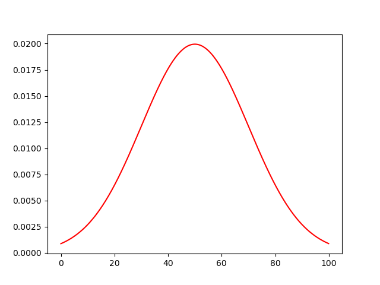

# データ分析

## 参考書籍

- 以下の書籍の自分なりのまとめ
  [データ分析に必須の知識・考え方 統計学入門(阿部 真人)](https://books.rakuten.co.jp/rb/16943959/)

## 1.1 データを分析する

### 〇データ分析の目的

データ分析の主な目的として、大きく以下の３つ 1. データを要約すること 1. 対象を説明すること 1. 新しく得られるデータを予測すること

#### 〇データを要約すること

生のデータをただ眺めてもなんもわからない。　 ⇒ 　データを要約して整理する手法が必要
例）平均値でデータの要約をする

#### 〇対象を説明すること

対象が持つ性質・関係性を明らかにし理解につなげること。人間だれしも自身の身の回りの事柄を観察し、関係性を見つけようとしている。
例）　赤いリンゴを食べたら甘く、青いリンゴを食べたらすっぱい　 ⇒ 　リンゴの色と味の間に関係性があるのでは？

ただし、ただただデータをとってグラフ化しただけでは、「たまたま得られた」可能性を排除できないし、傾向の強さの評価もできない。
**そこで、データ分析手法を用いることが必要になり、それによって初めて客観的な証拠（エビデンス）を手にしたことになる**

また説明（または理解）にはレベルが存在する。一般にデータ分析で登場する関係性には「因果関係」と「相関関係」がある。（詳しくは後述）

- 因果関係
  - ２つのうち一方（要因）を変化させると、もう一方（結果）を変えることができる関係（「○○ すると △△ となる」）
  - 因果関係がわかるということは仕組み（メカニズム）に関する知見を与えるので深い理解である
  - 例えば薬と血圧の関係で、薬の量で血圧が下がるとか？
  - ちなみに、要因を変化させることを「介入」という
  - 望ましい結果を得るように要因を変化させることを「制御」という
- 相関関係
  - 一方が大きいともう一方も大きい（または一方が大きいともう一方は小さい）という関係
  - 一方を変化させたときにもう一方が変化するとは限らない
  - 仕組みに関するいくつかの可能性を区別できないので浅い理解
  - 例えば年収と幸福度の関係で、必ずしも高年収が幸福とは限らないとか？
    - 逆に幸福度が高まると性格がポジティブになり仕事がうまくいくことで年収も上がった？
  - 相関関係は可能性を区別できない。
  - ただし相関関係があれば、未知データの予測が可能になる

#### 未知データを予測する

すでに得られたデータを基に、今後新しく得られるデータを予測すること
例）各年の夏の平均気温と秋の農作物収穫量の間にみられる関係から、その年の平均気温を基に秋の主閣僚を予測する
実際には予測とズレが生じるが、統計分析すうｒことでできるだけズレが少ない関係性を見出すことが可能になる。
そしてズレがどの程度なのかを評価することも重要である。

## 1.2 統計学の役割

### 〇統計学はばらつきの多い対象に対して力を発揮する。

データ分析における統計学ん重要な役割は「ばらつき」のあるデータに立ち向かい、説明や予測を行うこと。
「ばらつき」とはデータ一つ一つの値の差異。（一人ひとり身長が違うこととか）
統計学はこのようなばらつきを「不確実性」として評価し、「対象の説明と予測」を行う

### 〇確率を使う

統計学はばらつきや不確実性に対処する方法を与えてくれる。
その根底にあるのは、ばらつきや不確実性を確率として表現する確率論である。
そのため、統計学を学ぶにあたって確率の考え方が必須。

## 1.3 統計学の全体像

- 得られたデータを整理して要約する方法を[記述統計](#全数調査)と呼ぶ
  - データを基に平均や分散、グラフを出すこと
  - これによってデータそのものの特徴や傾向を把握することができる
  - 得られているデータだけに注目し、データ自体の性質を知ることが目的である
- 得られたデータからデータの発生元の対象を推測する手法を[推測統計](#推測統計)と呼ぶ
  - 対象の理解や未知データの予測のためには、データそのものではなく、データの発生元を知ることが必要。
  - データからデータの発生元を推測するにあたり、そもそもデータを得るとはどういうことかを考える必要がある。（後述）　・・・深い。。。

### 確率モデル（ここは結構大事かも）

データは対象を観測して得られたが、この対象の性質自体は直接観測できないし、扱うことも困難である。そこでデータが比較的単純な確率的な装置から姿勢されたと仮説してみる。この確率的な装置を「確率モデル」と呼ぶ。

- 具体例：さいころ
  - 現実のさいころは物理的な法則に従い、ほんの少しの動きの違いが、どの目が出るかを不確実にする。さいころを投げる手の動きから空気の流れまで精度よく観測し、どの目が出るかを記述するのは非常に困難。
  - そこで我々は確率を使って、さいころを各目が確率 1/6 で現れる「確率モデル」として表現している。

### 統計的推定と仮説検定

推測統計は主に以下の２つがある

- 統計的推定(statistical inference)
  - データから仮設した確率モデルの性質を推定する手法
  - 例えば少し角がかけたさいころは 1/6 でないかもしれない。そこで各目がどの程度の確率で出るさいころなのかを得られたデータから推測する。
- 仮説検定(statistical test)
  - 立てた仮説と得られたデータがどれだけ整合するかを評価し、仮設を支持するかどうかを判断する手法
  - 例えば少し角がかけたさいころでも均等に 1/6 で各目が出るという仮説をたて、100 回投げたら 1 の目が 50 回も出た場合は仮説が誤りだと判断する

### 様々な分析手法

統計分析には様々な手法がある。
その理由はデータのタイプや変数の数、仮定する確率モデルなどによって用いる手法が異なるから。

- データのタイプ
  - カテゴリ変数：血液型のようなカテゴリとして扱う
  - 量的変数：身長のような数値と扱う

## 2 母集団と標本

### 2.1 データ分析の目的と興味の対象

- データ分析の目的を設定する。
  〇〇を説明する、□□ を予測するといった具体的なデータ分析の目的を定めることで、どのような実験・観測を通してデータを得るべきか、どのようなデータを分析するべきかが変わってくる。
  研究やビジネスのデータ分析において、目的を明確にしないまま得られたデータに対し、いい加減なデータ分析手法を適用してなにか重要な発見をする、成果を出すというのは困難を極める。

- 興味の対象を設定する（データの範囲）
  - 血圧の新薬の効果を知る → **あらゆる(実際の治験参加者だけでなくすべての)** 高血圧の人
  - クラス対抗のテスト点数 → クラスに在籍している学生の人数

### 2.2 母集団

上述の興味の対象全体のまとまりを、**母集団(population)** という。
母集団のとらえ方も重要で、上述の血圧の例を取ると、新薬を与えられた人たちの母集団、与えられていない母集団を考えられる。

- 有限母集団
  要素数が有限の母集団。

- 無限母集団
  要素数が無限の母集団。

興味の対象の設定次第で、有限にも無限にもなる
例）　現在の日本人の平均身長　 → 　有限
　　　日本人の平均身長　 → 　無限（過去、未来も含めると人数は無限に広がる）

### 2.3 母集団の性質

#### 全数調査

母集団に含まれる要素数が有限であり、すべて調査可能な調査方法。母集団が無限の場合は調査は不可能。
例）　国民全員に対して調査する国勢調査

#### 標本調査

母集団の一部を分析することで母集団の性質を推測する推測統計(Inferential statistics)という枠組みがある。推測統計で調べる母集団の一部のことを**標本（サンプル）**といい、標本を母集団から取り出すことを、**標本抽出（サンプリング）**という。標本から母集団の性質を調べることを**標本調査**という。推測統計は母集団の性質について 100%言い当てることはできず、不確実性をともなって評価することになるのは確か。
例）一部の世帯を対象としてモニタリングし、全世帯の視聴率を推測している TV 視聴率

#### 標本の大きさ

母集団から抽出された標本は、有限の数の要素を含んでいる。標本に含まれる要素の数を、**標本の大きさ（サンプルサイズ、標本サイズ）**と呼び、アルファベットの$n$で表記する。
また、「サンプル数」という言葉は「サンプルサイズ」とは異なり、**標本の数**となるので注意。（２０人からなる標本 A と３０人からなる標本 B がある場合は、サンプル数が「２」となる。）

**サンプルサイズは母集団の性質を推測したときの確からしさや、仮説検定の結果にもかかわるため、重要な要素の一つであることを認識すること。**

## 3 統計分析の基礎

### 3.1 データのタイプ

#### 〇変数

データの内、共通の測定手法で得られた同じ性質をもつ値を**変数**という。（例　身長、体重）
データが１つだけ（身長のみ）なら１変数のデータ、身長と体重の２つなら２変数のデータ・・・といった風に変数が多ければ多いほど複雑になっていく。
統計学では変数の数を**次元**と表現することもある。２変数のデータなら２次元の平面上に各値をプロットしてグラフにできるから。

##### 量的変数

変数が数値で表される場合、「量的変数」という。その中でも以下の２つに分類可能。

- 離散型
  取りうる値が飛び飛びである変数を離散型の量的変数（離散変数）という。
  例）　さいころの値、回数や人数といったデータ
- 連続型
  連続値で表される変数を連続型の量的変数（連続変数）という。
  例）　身長、体重

##### 質的変数（カテゴリ変数）

変数が数値でなくカテゴリで表される場合、「質的変数またはカテゴリ変数」という。
例）　アンケートの Yes/No、コインの表/裏、晴れ/曇り/雨/雪といった天気・・・

### 3.2 データの分布

グラフを用いて「データがどこにどのように分布しているか」を可視化し、大まかにでーたの傾向を把握することが、データ分析の最初のステップ。

データの分布を可視化するにはある値がデータの中に何個含まれるか（度数、カウント数）を表すグラフである**度数分布図（ヒストグラム）**がよく使われる。
データのタイプによって、ヒストグラムの定義が異なっていく。

#### 離散型の量的変数のヒストグラム


横軸は数値、縦軸はその数値がデータに現れた個数（回数や度数、カウント数）を表す。

#### 連続型の量的変数のヒストグラム


連続型の場合厳密には小数点以下がいくらでも続くので同じ値は起こりえない。
そのため、ある範囲を設定しその範囲に含まれる数値の個数をカウントして縦軸とする。この範囲の幅のことを「ピン幅」という。

参考)[なるほど統計学園](https://www.stat.go.jp/naruhodo/4_graph/shokyu/histogram.html)

#### カテゴリ変数のヒストグラム


横軸は各カテゴリ、縦軸は各カテゴリのカウント数を表す。カテゴリ変数の値には大小関係はないので、横軸の順番に特別な意味はない。

参考)[Pandas でテーブルデータの数値・カテゴリ変数をヒストグラムで一括で表示](https://qiita.com/st07d31/items/5ae714c0c83609c7a84b)

#### ヒストグラムは可視化に過ぎない

**大まかなデータの分布はわかるものの、可視化だけでは見た人の主観的な判断にゆだねられてしまい、データの正確な記述や、対象の理解といった目的は達成できない。そこで **数値的な統計分析** が必要となってくる**

### 3.3 統計量

#### データを特徴づける

ヒストグラムではデータを「**客観的かつ定量的**」に評価・記述したことにはならない。
得られたデータに対して何らかの計算を実行して得られる値を一般に**統計量**という。
データからいくつかの統計量を計算し要約することで、データがどこにどのように分布しているかを定量的に特徴づけることができるようになる。
このようなデータそのものの性質を記述し、要約するための統計量を、**記述統計量**または**要約統計量**という。
記述統計量は主に量的変数に対して計算される。カテゴリ変数の場合、あるカテゴリの値が何個あるかというカウント値（または割合）だけでデータを記述・要約できてしまう。

#### 統計量と情報

１つまたは少数の統計量に要約することは、データの持つ情報の内、捨てている情報があることに注意。
例)平均値だけだとばらつきがわからない。

#### 様々な記述統計量

##### 代表値

- 平均値(mean)
  ```math
      \bar{x}=\frac{1}{n}(x_1+x_2+・・・x_n)=\frac{1}{n}\sum_{i=1}^{n}x_i
  ```
  - 外れ値 outer に影響されやすい
  - 標本から得られたときに「標本平均」ともいう
- 中央値(median)
  - 大きさ順で並べたときに中央に位置する値。
  - サンプルサイズが$n$の場合
    - $n$=奇数：中央値は一つ
    - $n$=偶数：中央値は２つ
  - サンプルの数値を使うわけではなく、**順番だけに着目**するため、極端に大きいまたは小さい値(外れ値 outer)に影響されない。
    - |1,2,5,10,1000|の場合でも中央値は「5」
- 最頻値(mode)
  - データの中で最も頻繁に現れる値。
  - 全体としてどうった値が典型的に現れるのかを把握する

代表値だけで判断するのも特徴が捉えられない場合があるので、ヒストグラムを描いて大まかに把握することが重量。

##### 分散と標準偏差

分散(variance)、標準偏差(standard deviation, S.D.)
データのばらつきを表す統計量である。標本から求めた場合標本分散(sample variance)や標本標準偏差(sample standard deviation)という。

標準分散は標本の各値と標準平均がどの程度離れているかを評価することでデータのばらつき具合を定量化する統計量。
標本分散$s^2$は以下の計算式

```math
s^2=\frac{1}{n}((x_1-\bar{x})^2+(x_2-\bar{x})^2+・・・(x_n-\bar{x})^2)=\frac{1}{n}\sum_{i=1}^{n}(x_i-\bar{x})^2
```

各値の平均値の差の二乗$(x_i-\bar{x})^2$を足し上げ、サンプルサイズ$n$で割ることで各値の平均値の距離の二乗を平均化した値としてばらつき度合いを評価している。
性質は以下３点

- $s^2\geqq0$
- すべての値が同一であるとき０（ばらつきなし）
- ばらつきが大きいと、$s^2$は大きくなる

標本標準偏差は標準分散のルートを取った値で、有する情報に違いはなし。

```math
s^=\sqrt{s^2}=\sqrt{\frac{1}{n}\sum_{i=1}^{n}(x_i-\bar{x})^2}
```

標準偏差は分散の平方根を取ってるため、元の単位と一致する。そのため度合いを定量化する指標としては標準偏差の方が感覚的にわかりやすい。

##### 箱ひげ図

##### 分析を可視化する様々な手法

##### 外れ値

データにはまれに大きな値または小さな値である外れ値が含まれることがある。
平均値から標準偏差２つ、３つ分以上離れている数値を外れ値と見なすことがある。
実際のデータ分析において外れ値は本来の値ではなく、測定や記録におけるミスである可能性も考慮する必要性がある。この外れ値を**異常値**という。
異常値である場合データから取り除きそれ以降で使わないようにする等の扱いが必要となる。

### 3.4 確率

#### 確率を学ぶにあたって

#### 確率の基本的な考え方

#### 確率変数

確率的に変動する変数を確率変数という。
一方、確率変数が実際に取る値を**実現値**という。
サイコロのような離散的な数値の場合は**離散型確率変数**、身長のような連続値の場合は**連続型確率変数**という。

#### 確率分布

横軸に確率変数、縦軸に確率変数の起こりやすさを表した分布。

- 確率変数が離散型の場合は縦軸が確率そのものを表す。
- 確率変数がカテゴリカルであれば横軸の順番に意味はない。（赤玉、白玉みたいに）
- 確率変数が連続型の場合は値に幅を持たせて確率を持たせる。（実現値の小数点以下が無限に続き、ある１つの確率変数の場合の確率が 0 になってしまうため）。その確率を導出するための関数を確率密度関数という。


確率密度関数の縦軸は確率そのものの値ではなく、相対的な起こりやすさを表す値となる。
そして確率変数がある値からある値の範囲に入る確率を求めるには確率密度関数の積分を計算し、x 軸と確立密度関数で囲まれる面積をもとめる。この面積が確率に相当する。
確率変数の定義域全体で積分を実行すると 1 になり、全事象のうちいずれかが起こる確率が 1 であることに対応している。

#### 推定統計と確率分布

推測統計では母集団の一部である標本か母集団の性質を推測しようとする。
そこで現実の世界の母集団を数学の世界の確率分布と仮定し、標本のデータはその確率分布から生成された実現値であるという仮定の元に分析を進めていく。
こうすることで「母集団と標本データ」という扱いづらい対象が、「確率分布とその実現値」という数学的に扱える対象に置き換えられる。
そして、以下の期待値や分散等の確率分布を特徴づけるような数値を標本から推定することで、母種団について理解していくという方針となる。

- 期待値(expected value)
  変数の確率的な起こりやすさを考慮した平均的な値を表す。(平均と呼んで問題なし)
  一般に確率変数$X$の期待値は$E(X)$で表記され以下のように定義される。

  - 離散型

    ```math
    E(X)=\sum_{i=1}^{k}x_{i}P(X=x_{i})
    ```

    ここで$k$は確率変数が取りうる実現値の個数となる。
    各実現値とその値が起こる確率を掛けて足す。
    ゆがみのないサイコロであれば、確率変数の各実現値は$x_{i}={1,2,3,4,5,6}$で確率$P(X=x_{i})$はどの$x_{i}$についても$1/6$なので、期待値は$1\times1/6+2\times1/6+3\times1/6+4\times1/6+5\times1/6+6\times1/6=3.5$となる。

  - 連続型
    ```math
    連続型　:\int(xf(x)dx)
    ```
    実現値$x$とそれに対応した確率密度$f(x)$を掛け算し、積分した値となる。
    積分の範囲確率変数の定義される全範囲である。

- 分散と標準偏差
  確率分布が期待値の周りにどの程度広がってるかを表す値を分散という。

  - 離散型

    ```math
    V(X)=\sum_{i=1}^{k}(x_{i}-E(X))^{2}P(X=x_{i})
    ```

  - 連続型
    ```math
    E(X)=\int(x-E(X))^{2}f(x)dx
    ```
    それぞれ期待値との差の二乗を用いることで、期待値からどの程度離れているかを評価している。
    標準偏差は分散$V(X)$の平方根を取った値として定義される。
    分散、標準偏差の性質は以下
  - ０以上であること
  - すべて同じ値が取れる場合には０
  - 期待値から離れた値が出やすいほど大きくなる

- 歪度（わいど）と尖度（せんど）
  歪度は分布が左右対称からどの程度歪んでいるか。尖度は分布の尖り度合いと分布の裾の重さ（分布の裾の方における確率の大きさ）を評価する。

#### 複数の確率変数

複数の確率変数がある場合、それらの間の関係性について考えることができる。
2 つの確率変数を同時に考えた場合の確率分布を同時確率分布$P(X,Y)$と言う。
例）２つのさいころ A,B
サイコロ A の出る目を$X$、サイコロ B の出る目を$Y$とすると、サイコロ A が１の目かつ、サイコロ B が２の目である確率を$P(X=1,Y=2)$と表す。

- 独立
  $X$と$Y$の 2 つの確率変数が独立であるとは、$X$と$Y$の同時確率分布$P(X,Y)$が各々の確率$P(X)$と確率$P(Y)$の積と等しいことを意味する。
  数式で記述すると以下
  ```math
  P(X,Y)=P(X)P(Y)
  ```
  これは一方がどんな値を取ろうと、もう一方が起こる確率は変わらないことを意味する。
  そのため、$P(X=1,Y=2)=P(X=1)P(Y=2)=1/36$となる。

#### 条件つき確率

一方の確率変数$Y$の情報が与えられた時のもう一方の確立変数$X$の確率変数を条件つき確率$P(X|Y)$といい、縦棒の右に条件を左に確率変数を記入する。
$Y$の情報を得れば$X$がわかるということ。$X$と$Y$が独立である場合、$P(X|Y)=P(X)$が成り立つ。つまり$Y$がどのような値であっても$X$が起こる確率には関係ない。

### 理論的な確率分布

#### 確立分布とパラメーター

理論的な確率分布は数式で表され、分布を決める数値であるパラメーターを持つ。
パラメータ（＝データ）を知るということは、確率分布の形状を知ることに相当する。

データ分析の目的は母集団の性質を知ることであり、この母集団は ○○ といったパラメータを持つ □□ という確率分布で表される（近似できる）とわかることは母集団の性質を知ることであるため、データ分析の目的そのものである。

#### 正規分布（ガウス分布）

統計学で最も頻繁に登場する確率分布。
正規分布（normal distribution）、別名ガウス分布(Gaussian distribution)。



連続型の確率変数に対して定義され、次の式で確率密度関数が表される。

```math
{{\displaystyle f(x)={\frac {1}{\sqrt {2\pi \sigma^{2}}}}\exp \!\left(-{\frac {(x-\mu )^{2}}{2\sigma^{2}}}\right)\quad}
}
```

※縦軸は確率密度（起こりやすさ）。この図は平均$\mu=50$、標準偏差$\sigma=20$の正規分布$N(50,20)$である

重要なのは確率分布が **平均$\mu$と標準偏差$\sigma$という２つのパラメータで決まる。** 正規分布を$N(\mu,\sigma^{2})$と表記し、平均$\mu=0$、標準偏差$\sigma=1$の正規分布$N(0,1)$を標準正規分布という。


赤：$\mu=0$、標準偏差$\sigma=1$
青：$\mu=2$、標準偏差$\sigma=1$
黄：$\mu=0$、標準偏差$\sigma=2$
緑：$\mu=2$、標準偏差$\sigma=3$

性質として、以下


例えば成人男性の身長で、平均$\mu=167.7(cm)$、標準偏差$\sigma=7.0$の場合、ランダムに成人男性を選んで選定した場合の身長は次の確率で存在する。

- $\mu-\sigma=160.6$から$\mu+\sigma=174.6$の範囲に約 68%(34.13%×2)
- $\mu-2\sigma=153.6$から$\mu+2\sigma=181.6$の範囲に約 95%((34.13%+13.59%)×2)
- $\mu-3\sigma=146.6$から$\mu+3\sigma=188.6$の範囲に約 99.7%((34.13%+13.59%+2.14%)×2)
  ※それぞれの確率は分布の面積である。

[統計学 ② 　 python を使って、確率密度関数(正規分布、標準正規分布)を覚えちゃう！](https://qiita.com/yossyyossy/items/601446f832f480d1d54a)

#### 標準化

一般に確率変数$x$あるいはデータに対して平均$\mu(\bar{x})$と標準偏差$\sigma(s)$を用いて以下の式とすることで平均 0 標準偏差 1 の値に変換することが可能。これを**標準化(standardizing, normalizing)**といい、変換された新しい値を**z 値**と呼ぶ。

```math
z=\frac{x-\mu}{\sigma}
```

これは平均からの距離が標準偏差で何個分あるかを表さしており、分布の中でどこに位置するか知ることができる。特に元の値が正規分布に従うのであれば、z 値は前述の〇$\sigma$の〇に相当する。

先ほどの、成人男性を例とし、180cm の人は$z=\frac{180-167.7}{7}=1.75$となり、平均から 1.75$\sigma$離れていることがわかる。

#### 様々な確率分布

統計学においてほかに重要な分布として、以下。

- 一様分布（連続型または離散型）
- 二項分布（離散型）
- ポアソン分布（離散型）
- 負の二項分布（離散型）
- 指数分布（連続型）
- ガンマ分布（連続分布） ...etc

また推測統計の計算で現れる検定統計量と呼ばれる統計量が従う確率分布（t 分布、F 分布、$x^{2}$分布など）もある。

## 4 推測統計

### 4.1 推測統計を学ぶ前に
#### 全数調査と標本調査
ここは参照とする

#### データを得るとは
母集団の要素を集めてヒストグラムを描く時の分布を **母集団分布** という。
母集団分布が量的変数の分布である場合、平均や分散はそれぞれ母平均、母分散という。そして一般に、このような母集団分布を特徴づける量を母数またはパラメーターという。
（日常として母集団に含まれる要素数を母数という場合もあるので、混同しないように）

#### 確立分布と実現値
確立分布の形を決めるとその確立分布に従う実現値を発生させる事ができる。
確立分布がわかっていれば、そこから発生した実現値がどのように確立的に振る舞うかを理解できるようになる。
ただし、複数の実現値を発生させるときは、簡単に扱えるように毎回独立に確立分布から発生させることを考える。
例えばサイコロの1の目が出た後は1の目が出にくくなるようなことは考えず、いつでも1の目は$\frac{1}{6}$の確率で現れるといった具合。

ここで実現値はまるでデータのように見えるということに気づく。
そして確立分布と実現値の関係は母集団と標本の関係によく似ているということ。
もちろん表面上だけでなく、母集団のヒストグラムで含まれる全ての要素数で縦軸のカウント数を割った値は割合になり、これを確率と見なすことができる。
そのため、母集団分布を確率分布として考えることが可能である。
さらに母集団からランダムかつ独立に一つ一つのデータを抽出することは確率分布として見た母集団分布からその確率分布に従う実現値を発生させることに相当する。
このように母集団と標本という実世界の話を、確率分布と実現値という数学の世界の言葉で記述できるようになる。
ここからは「母集団＝確率分布」、「標本＝確率分布に従う実現値」としてかんがえていく。

#### データからその発生元である確率分布を推測する
母集団と標本の関係を確率分布と実現値の関係に置き換えてみると、「得られた標本から母集団について推測する」という元々の目標を「得られた実現値からその実現値を発生させた確率分布について推測する」という目標に言い換えることが可能。
これが推測統計の最も重要な考え方であり、これから学んでいく様々な手法に共通する概念である。
例えば成人男性の身長という母集団の平均値に興味がある場合、標本のデータから成人男性の身長の確率分布における平均値を推測することで母集団を推測する。

#### 母集団分布のモデル化
現実世界の母集団分布の真の姿は多少いびつででこぼこしたりする。
しかしそのままでは数学的に扱いづらいため、数式で記述でき、数学的に扱える確率分布（モデル）で近似して話を進めることで、母集団の推定が容易になる。
これをモデル化と呼ぶ。

#### 無作為抽出
母集団から標本を得るのに重要なのが、無作為抽出（ランダムサンプリング）である。
これはデータを得る際に、母集団に含まれる要素を一つ一つランダムに選ぶという取り出し方である。

#### 無作為抽出の方法
無作為抽出するための最も理想的な方法は、標本になりうる全ての要素のリストを用意し、乱数を用いてサンプリングする方法である。
これを**単純無作為抽出法**という。この手法は労力と時間コストがかかることがある。
それに対して、実践的によく使われるのが**層化多段抽出法**である。
これは母集団をいくつかの層（グループ）にあらかじめ分けておき、各層の中から必要な数の調査対象をランダムに抽出する方法である。
他にも系統抽出、クラスター抽出など様々な手法が提案されている。

#### 偏った抽出の場合、適切な推測は難しい
日本人全体の年収を推測するのに東京の人だけで得た年収の標本は日本人全体の年収という母集団を反映していない

#### データの取り方
例えばワクチンの効果を知りたいときに母集団はあらゆる人種の人を含んでるにも関わらず、日本人からだけ標本を得る場合は母集団を考え直す必要がある。
その一方で、薬の作用機序が人種間に差異がなさそうであるような知見が得られているなら標本は日本人だけであっても、他の人種にもワクチンの効果があることがきたいできる。
こういった母集団について推定した結果をどの程度、一般性を持たせるかについては、それぞれの分野特有の知識（ドメイン知識）に依存する。
先行研究を踏まえつつ結果からわかることをどの程度一般化できるのか、またはその界隈や制約については丁寧に議論すべきである。

#### 推測統計を直感的に理解する
お味噌汁の味見
鍋に入っているお味噌汁全体を母集団としたときに、お玉で少量をすくい小皿に取り分けたのが標本である。
- ポイント1
本当に興味があるのは小皿のお味噌汁ではなく、鍋のお味噌汁である
→ 本当に興味があるのは標本のデータではなく、母集団である
- ポイント2
鍋のお味噌汁を飲み干して調べ尽くすことは困難である
→ 母集団の全ての要素を調べ尽くす全数調査は困難である。
- ポイント3
小皿程度の少ない量のお味噌汁で鍋のお味噌汁の味を「ほぼ」確認できる
→小さいサンプルサイズの標本から母集団を推測できる。
- ポイント4
お玉でお味噌汁をすくうときに、よくかき混ぜること
→標本を抽出するときには、ランダムサンプリングする必要がある

